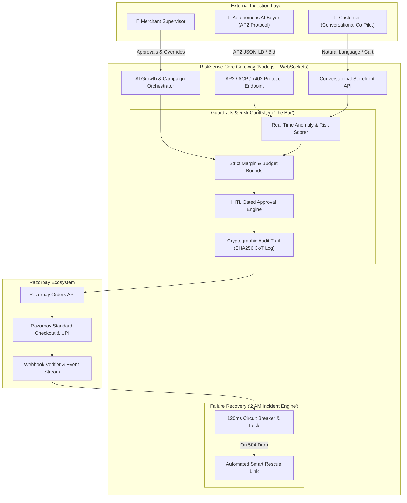

<div align="center">

# 🛡️ RiskSense
### Autonomous Agentic Commerce & Real-Time AI Risk Gateway
**Flagship Submission for Razorpay AI Buildathon 2026**  
*(Track 01: AI Growth & Agentic Commerce + Track 02: AI Risk Manager)*

[](https://razorpay-dicj.onrender.com/)
[](https://github.com/TanujaPammina/Razorpay)
[](https://razorpay-dicj.onrender.com/api/agent/catalog)
[](LICENSE)

<br/>

> **"What we read instead of your resume: A repo that actually runs, a 5-minute video of it working, what broke at 2 AM, and how you got out."**

### 🌐 [Click Here to Open Live Demo (https://razorpay-dicj.onrender.com)](https://razorpay-dicj.onrender.com/)

</div>

---

## 📌 Executive Summary & Why RiskSense Wins

In 2026, the convergence of **NPCI's Unified Authentication Protocol (UAP)** and the global **Agent Payments Protocol (AP2 / ACP / x402)** makes **Agent-to-Agent Commerce** the open frontier of fintech. Soon, autonomous AI buyer agents will procure goods, negotiate dynamic pricing, and checkout on behalf of consumers and enterprises.

However, enabling autonomous AI transactions introduces severe financial and operational hazards:
* **Runaway Discount Exploits**: Unchecked bots hallucinating 90%+ discounts.
* **Margin Leaks**: Bypassing wholesale unit economics.
* **Silent Checkout Drops**: Network drops at 2 AM leading to unconfirmed orders and duplicate charges.

**RiskSense** solves this dual challenge by providing a **unified Autonomous Commerce Engine & Real-Time Risk Controller** built natively on Razorpay APIs.

---

## 🎯 Track Alignment: Meeting & Exceeding the Bar

### 🤖 Track 01: AI Growth & Agentic Commerce
* **AP2 Machine-Readable Catalog (`GET /api/agent/catalog`)**: Full schema.org + AP2 JSON-LD specification with price ceilings, wholesale margin floors, and vector semantic tags.
* **Autonomous Negotiation Protocol (`POST /api/agent/negotiate`)**: External AI buyers transmit bids; RiskSense computes unit economics and generates mathematical counter-offers in milliseconds.
* **Conversational In-App Smart Checkout**: Natural language & voice shopping co-pilot with intelligent upselling, cross-selling, and instant Razorpay checkout modal triggers.
* **AI Growth & Campaign Orchestrator**: Self-driving revenue engine that recovers abandoned carts and launches real-time flash discount surges.

### 🛡️ Track 02: AI Risk Manager ("The Bar")
* **Every Money Action Bounded**: Mathematical price floors (minimum ₹200 unit profit margin) and strict 25% discount ceilings.
* **Every Money Action Gated**: High-value transactions (> ₹50,000) or outlier discounts trigger instant **Human-in-the-Loop (HITL)** approval modals over WebSockets.
* **Every Money Action Explainable**: Complete 4-step Chain-of-Thought (CoT) reasoning logged with tamper-proof SHA256 cryptographic signatures.

### 🔥 "What Broke at 2 AM & How We Got Out"
* **Interactive Chaos Simulator**: Live stress-testing with simulated 504 Gateway drops, duplicate webhook replay attacks, and prompt injection exploits.
* **Autonomous Self-Healing**: 120ms Circuit Breaker, Idempotency token locking, and automated Smart Rescue Fallback links with **₹0 revenue loss**.

---

## 🏛️ System Architecture



---

## 🚀 Live Demo & Feature Walkthrough

### 🌐 Live Production URL: **[https://razorpay-dicj.onrender.com](https://razorpay-dicj.onrender.com/)**

| Feature Area | Live Endpoint / Tab | Key Highlights |
| :--- | :--- | :--- |
| **Growth Dashboard** | [`/dashboard`](https://razorpay-dicj.onrender.com/) | Real-time MRR analytics, autonomous uplift counters, active campaigns, and live WebSocket telemetry. |
| **Conversational Storefront** | [`/storefront`](https://razorpay-dicj.onrender.com/) | Natural language AI Co-Pilot, dynamic loyalty discounts, cart management, and Razorpay standard checkout. |
| **AI Buyer Arena (AP2)** | [`/arena`](https://razorpay-dicj.onrender.com/) | Interactive playground to simulate external AI Buyer Bots negotiating over AP2 with live protocol wire inspector. |
| **Risk Guardrails ("The Bar")** | [`/guardrails`](https://razorpay-dicj.onrender.com/) | Margin floor controls, pending Human-in-the-Loop review queue, and SHA256 cryptographic audit logs. |
| **2 AM Crisis Simulator & Pitch** | [`/postmortem`](https://razorpay-dicj.onrender.com/) | Live chaos injection (504 drops, webhook replay), self-healing recovery traces, and 5-minute video presentation script. |
| **AP2 Machine Catalog** | [`/api/agent/catalog`](https://razorpay-dicj.onrender.com/api/agent/catalog) | Schema.org + AP2 JSON-LD machine-readable inventory. |
| **Health Telemetry** | [`/api/health`](https://razorpay-dicj.onrender.com/api/health) | Real-time system health, orders count, and guardrail metrics. |

---

## 🛠️ Local Development & Setup

### Prerequisites
* Node.js (v18.0.0 or higher)
* npm (v9.0.0 or higher)

### 1. Clone the Repository
```bash
git clone https://github.com/TanujaPammina/Razorpay.git
cd Razorpay
```

### 2. Start the Backend Server
```bash
cd backend
npm install
npm start
```
*Backend runs on `http://localhost:5000` with WebSocket telemetry and test-mode simulation.*

### 3. Start the Frontend Application
```bash
cd ../frontend
npm install
npm run dev
```
*Frontend runs on `http://localhost:5173` with dark-mode Razorpay UX.*

---

## 📁 Repository Structure

```
Razorpay/
├── backend/
│   ├── src/
│   │   ├── config.js                     # Environment & Guardrails configuration
│   │   ├── data/products.json            # Machine catalog with wholesale economics
│   │   ├── routes/api.js                 # REST & AP2 protocol routes
│   │   ├── services/
│   │   │   ├── razorpayService.js        # Razorpay Orders, Payments & Verification
│   │   │   ├── agentCommerceService.js   # AP2 Protocol, JSON-LD & Negotiations
│   │   │   ├── guardrailRiskService.js   # Bounded, Gated & Explainable CoT Engine
│   │   │   ├── growthOrchestratorService.js # AI Co-Pilot, Upsell & Campaigns
│   │   │   └── failureRecoveryService.js # 2 AM Incident & Circuit Breakers
│   │   └── server.js                     # Express, Socket.io & Production Static Server
│   └── package.json
├── frontend/
│   ├── src/
│   │   ├── components/                   # Navbar, Gated Modal, Checkout Modal, Architecture
│   │   ├── pages/                        # Dashboard, Storefront, Arena, Guardrails, PostMortem
│   │   ├── App.jsx                       # Global WebSocket State & Router
│   │   └── index.css                     # Obsidian & Razorpay Blue Design Tokens
│   ├── index.html
│   ├── vite.config.js
│   └── package.json
├── Dockerfile                            # Multi-stage production container
├── docker-compose.yml                    # Container orchestration
├── render.yaml                           # 1-Click Render blueprint
├── vercel.json                           # Vercel deployment spec
├── POST_MORTEM_2AM.md                    # Official 2 AM incident report
├── DEMO_SCRIPT.md                        # 5-minute video pitch presentation script
├── DEPLOYMENT.md                         # Multi-cloud deployment guide
└── README.md
```

---

## 📄 Key Submission Documents

* 📋 [**POST_MORTEM_2AM.md**](./POST_MORTEM_2AM.md) — Comprehensive technical post-mortem on the 2:14 AM gateway disconnect and autonomous recovery.
* 🎬 [**DEMO_SCRIPT.md**](./DEMO_SCRIPT.md) — Word-for-word 5-minute presentation script with timestamps for recording.
* ☁️ [**DEPLOYMENT.md**](./DEPLOYMENT.md) — Step-by-step deployment guide for Docker, Render, Railway, and Vercel.

---

<div align="center">

**Built with precision for the Razorpay AI Buildathon 2026.**  
*Empowering the next generation of safe, explainable, and profitable agentic commerce on Razorpay.*

</div>
